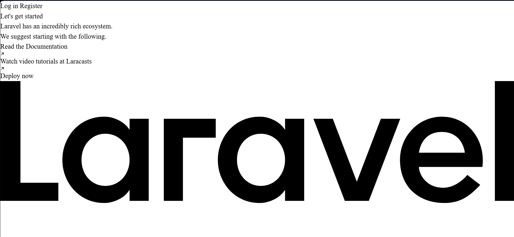
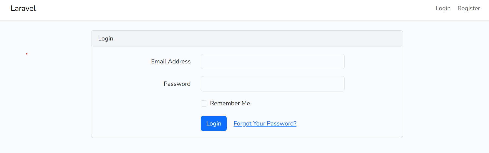
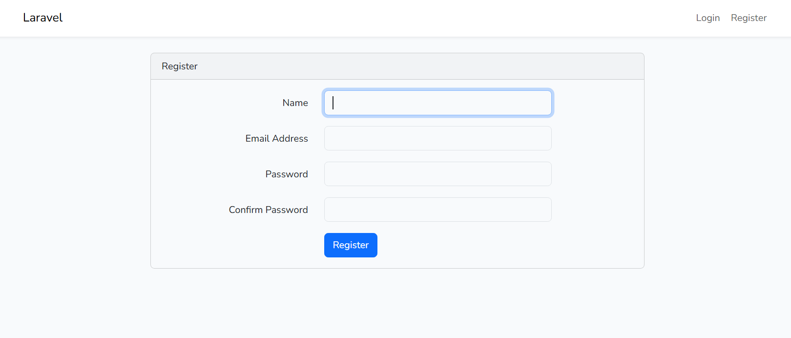
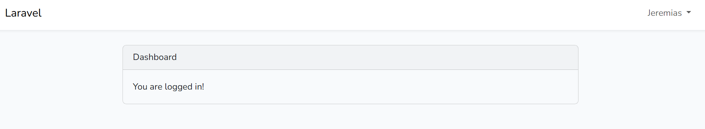
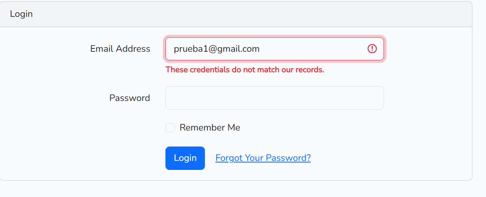

##  Primer vistazo
Al momento de acceder a la web "http://127.0.0.1:8000" teniendo "php artisan serve" y "npm run dev" activos, lo primero que se puede ver es lo siguiente:



No he logrado encontrar alguna alternativa, además de tener que implementar un propio CSS, para que se vea mejor. En mi caso he optado por dejar a un lado esta página.

---

##  Entrada al sistema de autenticación

En lugar de acceder siempre a la pantalla de inicio y buscar el botón que lleva a la sección de inicio de sesión/registro, he cambiado el código para que se acceda desde el primer momento. Para realizarlo se debe ir a la carpeta del proyecto, acceder a la carpeta ROUTES y luego al archivo web.php. La ruta completa en mi caso sería C:\xampp\htdocs\prueba1\routes\web.php. El código que introduje en el archivo fue el siguiente:
``` bash
<?php

use Illuminate\Support\Facades\Route;

Route::get('/', function () {
    return redirect('/login');
});

Auth::routes();

Route::get('/home', [App\Http\Controllers\HomeController::class, 'index'])->name('home');
```

El cambio importante fue realizado en la línea 6, aquí se indica que en lugar de abrir la vista de bienvenida al entrar a la página, se redirecciona al usuario a la sección de inicio de sesión. Al hacer esto podremos ver esto:



---

##  Prueba de Autenticación

Para comprobar que el sistema de inicio de sesión funciona, se debe primero crear un usuario. Esto se hace al acceder a la sección de registro:



Es necesario realizar este paso debido a que la base de datos del proyecto cuenta con una tabla llamada users y esta comienza vacía. Al registrar un usuario correctamente se iniciará sesión de forma automática, resultando en esta pantalla:



Para los casos en donde hay equivocación en los datos de inicio de sesión, esto se podrá ver:



---
<div align="center">

### 📌 Información del Laboratorio

🎓 **Universidad Tecnológica de Panamá**

👤 **Estudiante:** Jeremias Donoso  •  📧 **Correo:** jeremias.donoso@utp.ac.pa

📚 **Curso:** Desarrollo de Software 7   •   👩‍🏫 **Instructora:** Irina Fong

📅 **Fecha Final de Ejecución:** 14 de abril de 2026  

---

</div>


